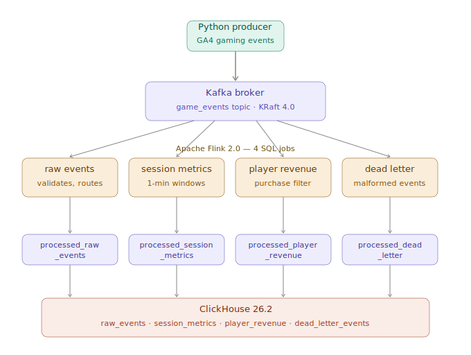

# kafka-flink-gaming-analytics

Real-time gaming analytics pipeline — Python producer → Kafka → Flink SQL → ClickHouse. Fully containerised with Docker Compose, no external services required.

## Architecture



Events are produced as GA4-style gaming JSON, written to a Kafka topic, processed by 4 parallel Flink SQL jobs, routed to dedicated output topics, and consumed by ClickHouse via its native Kafka engine and materialized views.

## Stack

| Component | Version | Role |
|---|---|---|
| Apache Kafka | 4.0.2 | Message broker (KRaft — no Zookeeper) |
| Apache Flink | 2.0.0 | Stream processing (4 SQL jobs) |
| ClickHouse | 26.2.4.23 | OLAP sink |
| Python | 3.12 | Event producer |
| Kafka UI | v0.7.2 | Topic browser |

## Quickstart

```bash
git clone https://github.com/xDevagya/kafka-flink-gaming-analytics
cd kafka-flink-gaming-analytics
docker compose up -d --build
```

Wait for all containers to be healthy (~30s), then submit the Flink jobs:

```bash
bash scripts/submit_jobs.sh
```

## UIs

| Service | URL |
|---|---|
| Kafka UI | http://localhost:8080 |
| Flink UI | http://localhost:8081 |
| ClickHouse | http://localhost:8123/play |

## Flink jobs

| Job | What it does | Output topic | ClickHouse table |
|---|---|---|---|
| `raw_events.sql` | Validates and routes all events | `processed_raw_events` | `gaming.raw_events` |
| `session_metrics.sql` | 1-minute tumbling window aggregations | `processed_session_metrics` | `gaming.session_metrics` |
| `player_revenue.sql` | Filters purchase events, extracts value | `processed_player_revenue` | `gaming.player_revenue` |
| `dead_letter.sql` | Catches malformed events | `processed_dead_letter` | `gaming.dead_letter_events` |

## Sample queries

```sql
-- top players by revenue
SELECT user_id, username, SUM(total_revenue_usd) AS revenue, SUM(purchase_count) AS purchases
FROM gaming.player_revenue
GROUP BY user_id, username
ORDER BY revenue DESC
LIMIT 10;

-- events per minute by platform
SELECT window_start, platform, SUM(event_count) AS events, SUM(unique_users) AS users
FROM gaming.session_metrics
GROUP BY window_start, platform
ORDER BY window_start DESC
LIMIT 20;

-- dead letter breakdown
SELECT error_reason, count() AS cnt
FROM gaming.dead_letter_events
GROUP BY error_reason;
```

## Configuration

All versions and ports live in `.env`. Change any value there — `docker-compose.yml` references variables and never needs to be edited directly.

To reset all data:

```bash
docker compose down
docker volume rm kafka-flink-gaming_clickhouse_data
docker compose up -d --build
```

## Project structure

```
.
├── docker-compose.yml
├── .env
├── producer/
│   ├── Dockerfile
│   ├── requirements.txt
│   └── producer.py
├── flink/
│   ├── Dockerfile
│   └── jobs/
│       ├── raw_events.sql
│       ├── session_metrics.sql
│       ├── player_revenue.sql
│       └── dead_letter.sql
├── clickhouse/
│   └── init.sql
├── scripts/
│   └── submit_jobs.sh
├── docs/
    └── architecture.svg
```